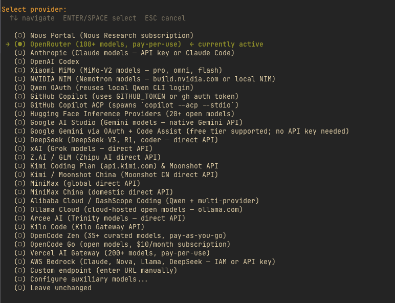
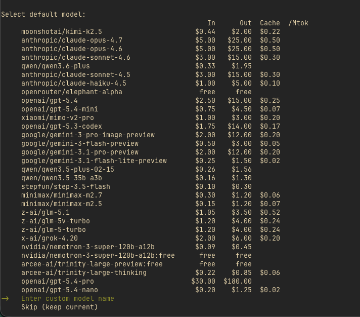

# Part 1: Setting Up Hermes Agent and OpenRouter for Agentic Coding

We're going to get started by setting up our development environment using [Hermes](https://hermes-agent.nousresearch.com/) and [OpenRouter](https://openrouter.ai).

Why are we using Hermes and OpenRouter? Hermes is an AI agent conceptually similar to OpenClaw but with some key differences. It has solid built-in memory, tool use, custom profiles, and a self-learning skills system. That last part is one of the most powerful parts of Hermes and one of the reasons it works so well as a coding agent.

If you haven't tried Hermes for coding yet, follow this tutorial to get it up and running. Because of features like its built-in memory and self-improving skills system it is a very powerful coding tool.

It learns how you work and improves the more you use it.

Hermes also works with OpenRouter out of the box. This is great because you can easily switch between models whenever you like with a single config change. If you use OpenRouter, you can use whatever model you want and switch to it in seconds.

Kimi K2.6 was released on April 20, 2026, so I used it while building Capitol Tracker in Hermes. Model availability changes quickly, so treat Kimi K2.6 as the example model for the walkthrough rather than a requirement.

By the end of this lesson, you will have:

- Hermes Agent installed locally
- OpenRouter connected as your model provider
- A current OpenRouter model selected inside Hermes
- Hermes trained as an OpenRouter expert
- A working project directory ready for the rest of the series
- A clear architecture plan for the State Capitol Tracker

In the next part, we will use this setup to build the tracker with the OpenRouter Agent SDK, learning how it works in the process.

## Prerequisites

You should have:

- An OpenRouter account and API key
- Node.js 20+ or 22+, npm, and git
- Python installed on your machine
- A terminal you are comfortable working in

If you have not created an OpenRouter account yet, do that first at [openrouter.ai](https://openrouter.ai). You will need your API key shortly.

## Why this setup is a good combo

As we touched on above, Hermes is built as a provider-agnostic agent framework rather than a single-provider coding harness. It combines terminal tool use with longer-lived capabilities like self-improving skills and memory. This makes it really efficient and enjoyable to use over the long term since it actually improves over time rather than needing new context every time you start it up.

So Hermes gives us an agent environment we can keep using as the project becomes more capable, and OpenRouter gives us a model layer we can swap and improve without tearing everything else apart.

We get this flexibility both inside our coding agent itself (because we are integrating Hermes with OpenRouter) and in our product because we are going to be building it with the OpenRouter Agent SDK (more on this in the next part of the tutorial).

That gives us several benefits out of the box:

- **Try new models instantly.** When a new coding model drops, you can switch to it without changing your agent setup or rewriting any client code.
- **Route around downtime automatically.** If one provider is overloaded or down, OpenRouter can fall back to another serving the same model.
- **One API, one key.** No need to manage separate accounts and credentials for every provider you want to use.
- **Consolidated billing.** All your usage across every model and provider shows up in one place.

Let's get started.

## Step 1: Set up Hermes

The best place to start is the [Hermes Quickstart guide](https://hermes-agent.nousresearch.com/docs/getting-started/quickstart).

That will walk you through getting Hermes set up and choosing an OpenRouter model.

After you get it installed, you can run through the setup process with `hermes setup` to go through the full setup process and set Hermes up with messaging access. During that process you'll have a chance to select OpenRouter as your provider, provide your API key, and select your model.

You can also just run `hermes model` if you only want to set up the provider and model or if you already have Hermes set up on your machine.



The screenshots in this section are illustrative because Hermes and OpenRouter model lists change frequently. If the model you want to use is not in the predefined list, visit [https://openrouter.ai/models](https://openrouter.ai/models) to get the current model slug. Click the model you want and copy its slug into Hermes as a custom model. For the run shown in this tutorial, I used `moonshotai/kimi-k2.6`; before publishing or rerunning the tutorial, quickly confirm that slug still appears in the OpenRouter model list.



## Step 2: Teach Hermes to be an OpenRouter expert

Now we are going to give Hermes a focused knowledge injection. The goal is to turn it into an expert on OpenRouter and the Agent SDK so that when we start building in Part 2, Hermes is working from solid documentation rather than guessing at APIs. This will save you and Hermes a lot of tokens and a lot of time iterating back and forth on implementation details.

Inside Hermes, paste the following prompt. Feel free to customize this to your liking:

```text
Use the following materials to train yourself to become an expert on OpenRouter and the OpenRouter TypeScript Agent SDK. We are going to build agentic applications with `@openrouter/agent`, especially `OpenRouter`, `callModel`, `tool`, `StateAccessor`, and the built-in stop conditions. Treat `@openrouter/sdk` as a supporting dependency/source reference only; the app code should use the Agent SDK primitives.

OpenRouter docs index: https://openrouter.ai/docs/llms.txt

This is an index of all the different docs pages OpenRouter has. Structure your openrouter skill so that it effectively utilizes and refers to these docs when it needs to build something.

When I ask you to help build with OpenRouter, apply this knowledge. Do not guess at API signatures. If you are unsure about a specific method or parameter, refer back to these sources or ask me to clarify before writing code.

Whenever we begin working on an openrouter project in a new session we should pull the latest version of the docs to make sure we are working with the most current documentation.

In addition, you should have the source code for the Agent SDK itself available to refer to as you are building. Clone the [OpenRouter TypeScript Agent SDK repo](https://github.com/OpenRouterTeam/typescript-agent) so it is available to you whenever you are building and keep it up to date when you begin new sessions. Use the repository README, source files, and official OpenRouter docs as your source of truth.
```

When I ran this in Hermes it did a bunch of code exploration, cloned the agent repo and created a new skill called `openrouter-typescript-agent`.

Here's the output Hermes gave me after it finished up:

```markdown
Done. Here's what I've set up:

     1.  Cloned the SDK repo to ~/typescript-agent and inspected the full source tree.
     2.  Fetched the docs index from https://openrouter.ai/docs/llms.txt and mapped all relevant TypeScript SDK pages.
     3.  Read the key source files to extract exact API signatures:
         - src/inner-loop/call-model.ts — callModel() implementation
         - src/lib/tool.ts — tool() and serverTool() factories
         - src/lib/tool-types.ts — all type definitions
         - src/lib/model-result.ts — ModelResult consumption patterns
         - src/lib/stop-conditions.ts, async-params.ts, conversation-state.ts, next-turn-params.ts, tool-executor.ts
         - src/openrouter.ts — OpenRouter client class
     4.  Created a skill openrouter-typescript-agent with a complete reference covering:
         - Pre-session ritual (pull latest docs + update repo)
         - callModel request shapes and all consumption patterns
         - Tool types (regular, generator, manual, server)
         - Tool context, approval, nextTurnParams, toModelOutput
         - Stop conditions, state management, format compatibility
         - Streaming events and important constraints/pitfalls
         - Direct links to relevant docs pages
     5.  Saved to memory the repo location and the ritual for starting new OpenRouter sessions.

     Whenever we start a new OpenRouter project, I will now:
     - Run cd ~/typescript-agent && git pull
     - Refresh the docs index with curl -s https://openrouter.ai/docs/llms.txt
     - Load the openrouter-typescript-agent skill
     - Check source files before guessing at any API signatures

     Ready to build when you are.
```

Take a look at the skill file it creates for you and adjust anything you like. Remember it doesn't need to be perfect, Hermes will adjust it for you over time as you build more.

Alright now let's put it to the test by building our project in Hermes.

## Step 3: Planning our capitol tracker

Everyone has their own preferences when it comes to agentic coding. For this tutorial, we'll start by having our agent build a working first version quickly, then we'll review the code together using a set of checkpoints so you understand how each piece works and can verify your implementation against known-good patterns.

I'm going to kick things off with this prompt in a new Hermes session, feel free to use this or create your own to get started. By default, Hermes has its own internal `projects` folder it uses to work on new projects. You can either work from there or instruct it to work out of another folder directly.

```markdown
i want to create a new project called capitol tracker. capitol tracker is meant to be an agentic tracker for state legislatures. i want to start by doing a light brainstorming/planning session so i can figure out what i want it to look like and how it will work, so far i know i want to build the core architecture with openrouter's agent sdk and the callmodel primitive
```

After I hit enter, Hermes immediately pulled up the skill it created and kicked off a brainstorming session with a few questions and suggestions.

At this point your task is to converse with Hermes until you have a solid direction to start heading. Try not to overplan every little detail of the application but just get the big picture figured out and start working. I often find when I am building things with agents the best way to build is one prompt at a time and let the process dictate what the next best step is rather than trying to create the perfect plan from the beginning.

After some back and forth with Hermes, here is the starting point I have for Capitol Tracker:

The Capitol Tracker MVP will be a CLI built with the OpenStates API for getting the legislature data and the OpenRouter TypeScript SDK for building the actual agent functionality.

The product shape I wanted was simple: run a digest command to summarize recent bills, then run a chat command when you want to dig into a specific bill. In the reference implementation, setup is explicit rather than wizard-driven: create a `.env` file for API keys, optionally create `~/.capitol-tracker/profile.json` for state and preference overrides, run `npx tsx src/cli/index.ts digest 1`, then run `npx tsx src/cli/index.ts chat` for follow-ups. A packaged `npx capitol-tracker digest` command and interactive setup wizard would be natural polish later, but we will keep the tutorial focused on the working agent architecture.

Your agent might produce a different structure — maybe it puts everything in one file, uses classes instead of factory functions, or names things differently. That is fine. In Part 2 we will review the code using pattern-based checkpoints, not file-by-file comparisons. The goal is to understand why each piece works, not to make your files match mine exactly.

Before moving on, ask Hermes to leave you with a concrete project root and a runnable TypeScript scaffold. A good handoff checklist is:

- `pwd` points at the Capitol Tracker project directory.
- `package.json` exists and includes scripts for `build`, `test`, `fetch`, `digest`, and `chat`.
- The project depends on `@openrouter/agent`, `dotenv`, `zod`, `tsx`, `typescript`, and `@types/node`.
- `.env.example` documents `OPENROUTER_API_KEY`, `OPENSTATES_API_KEY`, and optional `OPENROUTER_MODEL`.
- `src/cli/index.ts` exists and imports `dotenv/config`.
- `npx tsc --noEmit` runs cleanly.

If any of those are missing, have Hermes add them before starting Part 2.

## What you have now

At this point you have:

- Hermes installed and working
- OpenRouter connected as your provider with a coding model selected
- Hermes trained as an OpenRouter and Agent SDK expert
- A project repository initialized
- The Agent SDK source cloned locally for Hermes to reference
- A verified working environment
- An architecture plan for the State Capitol Tracker

In the next part we're going to actually build this out.
