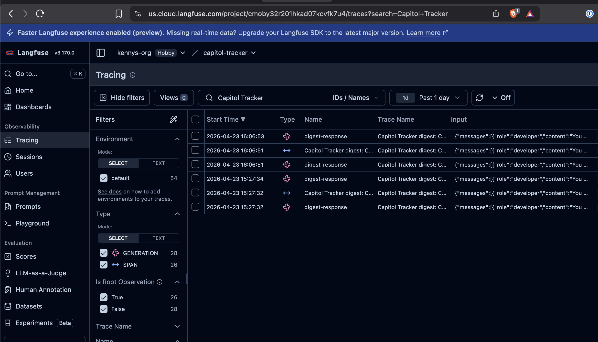
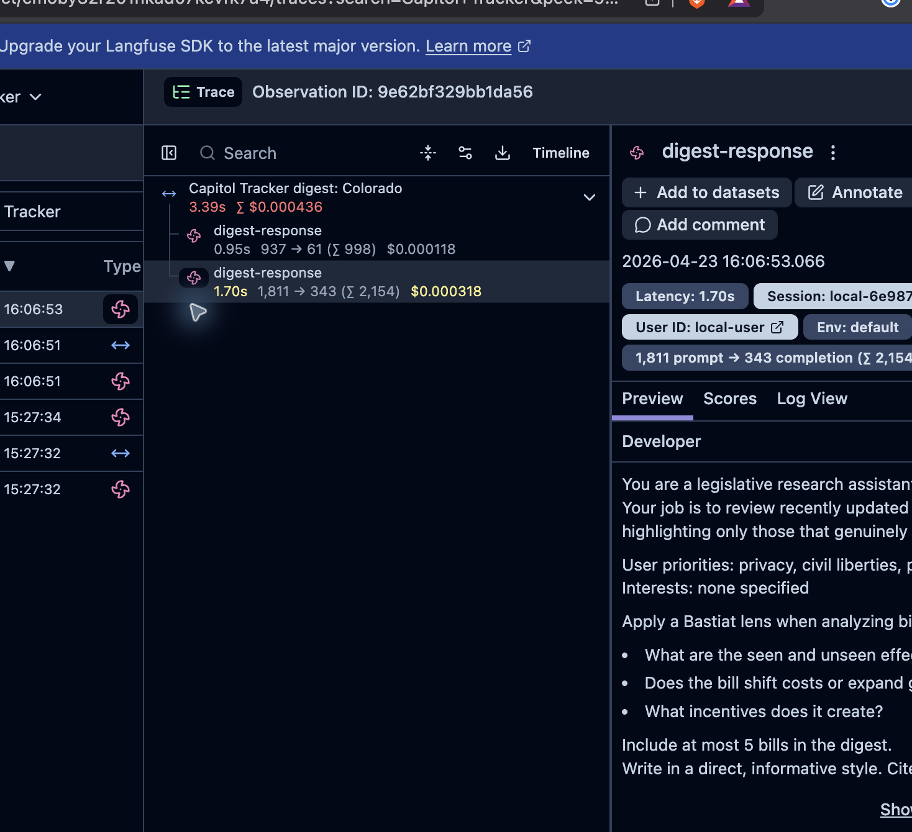

# Part 3: Observability, Evals, and Cost Tracking with OpenRouter Broadcast and Langfuse

In Part 2, we built a working Capitol Tracker CLI with the OpenRouter Agent SDK. It can fetch recent bills, generate a digest, and answer follow-up questions using tools and persisted conversation state.

That is enough to prove the app works. But it is not enough to operate or improve it, at least not without some ad-hoc vibes-based evals and debugging, which are not enough for systematic improvement.

Right now, if the digest is slow, expensive, too shallow, or calls the wrong tools, you have to infer what happened from terminal output. That is fine for a prototype, but it is a terrible feedback loop once you start changing prompts, swapping models, or adding more tools.

In this lesson, we are going to close that loop.

By the end of this lesson, you will have:

- OpenRouter Broadcast sending traces to Langfuse
- Trace metadata added to your Capitol Tracker requests
- A way to group digest and chat runs into sessions
- Cost, token, latency, model, provider, and tool-call visibility
- A simple eval rubric for judging digest quality
- A repeatable workflow for improving your agent instead of guessing

The important point: we are not going to build a custom tracing system. OpenRouter already sees every model request, token count, provider route, latency, cost, and tool-call signal. Broadcast lets us send that data to Langfuse automatically.

## Prerequisites

You should have:

- Completed Part 2 or cloned the reference repo at [github.com/kenrogers/capitol-tracker](https://github.com/kenrogers/capitol-tracker)
- A working `OPENROUTER_API_KEY`
- A working `OPENSTATES_API_KEY`
- A Langfuse account or self-hosted Langfuse instance
- Access to [OpenRouter Settings > Observability](https://openrouter.ai/workspaces/default/observability)

You do not need to add the Langfuse SDK to this app for the main path. Langfuse receives traces from OpenRouter through Broadcast. That is the point of this integration: less instrumentation in your application code.

## What Broadcast gives us

Before changing code, let's clarify what data we are trying to get.

For each OpenRouter request, Broadcast can send trace data that includes:

- Request and response content
- Token usage
- Cost
- Timing and latency
- Model slug
- Provider name
- Tool usage
- Custom metadata such as trace ID, trace name, session ID, environment, and feature name

That is exactly what we need for Capitol Tracker.

When the digest feels slow, we can inspect latency. When it gets expensive, we can inspect token usage and tool-call count. When the answer quality drops, we can inspect the prompt, tool results, model output, and compare runs over time.

OpenRouter also supports Input & Output Logging in its own Logs page. That is useful for quick debugging inside OpenRouter. Broadcast is different: it sends traces to an external observability platform like Langfuse, Datadog, Braintrust, PostHog, S3, or others. For this tutorial, we will use Langfuse because it gives us tracing plus eval workflows in one place.

If you want to cross-check the setup against the primary docs, keep these nearby: [OpenRouter Broadcast](https://openrouter.ai/docs/guides/features/broadcast), [OpenRouter Broadcast to Langfuse](https://openrouter.ai/docs/guides/features/broadcast/langfuse), and [Langfuse's OpenRouter integration guide](https://langfuse.com/integrations/gateways/openrouter).

## Step 1: Create a Langfuse API key

Start in Langfuse.

Go to your Langfuse project, then open **Settings > API Keys** and create a new key pair. Copy both values:

- Secret Key
- Public Key

If you are using Langfuse Cloud, also note your region. The default OpenRouter Broadcast configuration uses `https://us.cloud.langfuse.com`, but you can change the Base URL if your project is in a different region or if you are self-hosting Langfuse.

Langfuse will also show a ready-to-copy `.env` block. That is useful if you are instrumenting your app with the Langfuse SDK, but for this tutorial you only need the keys and the base URL so OpenRouter can send traces through Broadcast.

## Step 2: Enable Broadcast in OpenRouter

Now go to [OpenRouter Settings > Observability](https://openrouter.ai/workspaces/default/observability).

Toggle **Enable Broadcast**.

Then add Langfuse as a destination and enter:

- **Secret Key**: your Langfuse Secret Key
- **Public Key**: your Langfuse Public Key
- **Base URL**: optional; use your Langfuse region or self-hosted URL if needed

Click **Test Connection** before saving. When the connection succeeds, click **Add**.

Once this is enabled, OpenRouter will asynchronously send traces for matching API requests to Langfuse. That means Broadcast does not add latency to your user-facing request path.

If you are working in an organization or workspace, pause for one sanity check here: the API key your app uses must belong to the same OpenRouter workspace where you enabled Broadcast, unless you deliberately configure the destination's API key filter. If you add a filter, make sure the Capitol Tracker API key is selected.

### A quick note on privacy

Broadcast can include prompt and completion content. That is exactly what we want while debugging this local tutorial app, because we need to see what the digest prompt looked like and what bill details the model saw.

For production apps, decide deliberately. OpenRouter lets you configure Privacy Mode per destination. When Privacy Mode is enabled, prompt and completion content are stripped before traces are sent, while token counts, cost, timing, model information, and metadata are still sent.

For this tutorial, keep content visible so you can inspect the agent.

## Step 3: Send a first trace

Before adding custom metadata, run the app once to verify the pipe is working.

```bash
npx tsx src/cli/index.ts digest 1
```

Then open Langfuse and look for a new trace.

It may take a few minutes to appear because Broadcast sends traces asynchronously after the request completes. If you do not see anything, refresh Langfuse, wait a bit, and then check these things:

- Broadcast is enabled in OpenRouter
- The Langfuse destination test passed
- You are using the same OpenRouter account or organization where Broadcast is configured
- If you filtered the destination to specific API keys, your CLI is using one of those keys
- Your request actually completed through OpenRouter

You can also open the action menu on the configured Langfuse destination in OpenRouter and click **Send Trace**. That sends a small test trace through the same destination. If the OpenRouter UI says the test trace was sent but Langfuse still shows no traces after a refresh, wait a minute and widen the Langfuse time filter before changing code. At that point the issue is usually destination/project/time-filter related, not your agent implementation.

At this point, the trace should already show useful data: model, provider, input, output, token usage, cost, latency, and tool information. If your app has not attached metadata yet, the trace name will probably be generic, often something like `OpenRouter Request`. That is not a failure. It means Broadcast is working, but your application has not told OpenRouter how to name or group the run yet.

In a first run without custom metadata, one Capitol Tracker digest may produce several generic rows named `OpenRouter Request` or `LLM Generation`. That is normal for an agent loop. The model first asks to call tools, then OpenRouter records another generation for the final answer after tool results are available.

So next we will add metadata.

## Step 4: Add trace metadata to Capitol Tracker

OpenRouter supports observability metadata directly on the request. In raw API requests, the docs show fields like `session_id` and `trace`. In the TypeScript SDK, those fields are camel-cased, so we will use `sessionId` plus a `trace` object with `traceId`, `traceName`, `spanName`, `generationName`, and `additionalProperties`. The SDK serializes those into OpenRouter's API fields.

The OpenRouter Langfuse Broadcast docs map those API fields into Langfuse: `trace_id` becomes the trace ID, `trace_name` becomes the trace name, `span_name` becomes a parent span, `generation_name` becomes the generation name, and extra trace fields become metadata.

The useful fields for this app are:

- `user`: a stable identifier for the end user
- `sessionId`: groups related requests together
- `trace.traceId`: groups multiple API requests into one trace
- `trace.traceName`: requests a readable trace name in Langfuse
- `trace.spanName`: requests a name for the logical app step
- `trace.generationName`: requests a name for the model generation
- `trace.additionalProperties`: custom metadata for filtering and analysis; the SDK serializes these as extra keys inside the raw `trace` object

For a CLI app, we do not have real user accounts, so we can use something simple like `local-user`. For production, use your application's actual user ID.

Let's ask Hermes to add this cleanly rather than scattering objects across the codebase. The code blocks below are review targets: they show the shape we want Hermes to produce, not random snippets for you to paste into whichever file happens to be open.

```markdown
Add OpenRouter observability metadata to Capitol Tracker.

Create a small trace helper that builds consistent metadata for digest and chat runs. Use the OpenRouter Agent SDK request fields, not a Langfuse SDK. The TypeScript SDK field is sessionId. The trace object should use traceId, traceName, spanName, generationName, and additionalProperties. Store a stable local workflow session ID in ~/.capitol-tracker/session-id and use it as sessionId for both digest and chat. Put environment, feature, state, legislative_session, days_back, and command inside additionalProperties.

Then update the digest and chat callModel calls so Broadcast traces in Langfuse are grouped and named clearly. Keep the existing behavior unchanged.
```

After Hermes makes the change, review the diff. You are looking for a helper with this shape:

```typescript
import { randomUUID } from "crypto";
import { existsSync } from "fs";
import { mkdir, readFile, writeFile } from "fs/promises";
import { homedir } from "os";
import { dirname, join } from "path";
import type { Profile } from "../config/loader.js";

type CommandName = "digest" | "chat";
const SESSION_ID_PATH = join(homedir(), ".capitol-tracker", "session-id");

export function createRunId(prefix: CommandName): string {
  return `${prefix}-${randomUUID()}`;
}

export async function getWorkflowSessionId(): Promise<string> {
  if (existsSync(SESSION_ID_PATH)) {
    const existing = (await readFile(SESSION_ID_PATH, "utf-8")).trim();
    if (existing.length > 0) return existing;
  }

  const sessionId = `local-${randomUUID()}`;
  await mkdir(dirname(SESSION_ID_PATH), { recursive: true });
  await writeFile(SESSION_ID_PATH, sessionId);
  return sessionId;
}

export async function buildTraceMetadata(options: {
  runId: string;
  command: CommandName;
  profile: Profile;
  daysBack?: number;
}) {
  const traceName =
    options.command === "digest"
      ? `Capitol Tracker digest: ${options.profile.state}`
      : `Capitol Tracker chat: ${options.profile.state}`;

  return {
    user: "local-user",
    sessionId: await getWorkflowSessionId(),
    trace: {
      traceId: options.runId,
      traceName,
      spanName: options.command,
      generationName: `${options.command}-response`,
      additionalProperties: {
        environment: process.env.NODE_ENV ?? "development",
        feature: "capitol-tracker",
        command: options.command,
        state: options.profile.state,
        legislative_session: options.profile.session,
        days_back: options.daysBack?.toString() ?? "n/a",
      },
    },
  };
}
```

Your file paths may differ. In my reference app, this helper would fit naturally near the config code, because it depends on the user's profile. If your agent puts it in `src/observability/trace.ts`, that is also fine.

The important thing is not the exact file name. The important thing is that every model call gets consistent metadata.

Next, review the digest agent diff. You want Hermes to import the helper, build metadata once per run, and spread it into the existing `callModel` request:

```typescript
const runId = createRunId("digest");
const metadata = await buildTraceMetadata({
  runId,
  command: "digest",
  profile,
  daysBack,
});

const result = client.callModel({
  model,
  instructions: buildInstructions(profile),
  input:
    `Here are the recently updated bills for ${profile.state}:\n\n` +
    stubs
      .map(
        (b) =>
          `- ${b.identifier}: ${b.title} [session: ${b.session}, subjects: ${b.subject.join(", ") || "none"}, updated: ${b.updatedAt}]`
      )
      .join("\n") +
    `\n\nReview these bills. For any that seem highly relevant, call get_bill_details to inspect sponsors, actions, and sources. ` +
    `Then write a concise digest highlighting only the bills that genuinely matter. Max ${profile.digest.max_items} entries.`,
  tools: [billTool] as const,
  stopWhen: stepCountIs(10),
  ...metadata,
});
```

Then review the chat agent diff for the same pattern:

```typescript
const runId = createRunId("chat");
const metadata = await buildTraceMetadata({
  runId,
  command: "chat",
  profile,
});

const result = client.callModel({
  model,
  instructions,
  input,
  tools,
  stopWhen: stepCountIs(15),
  state,
  ...metadata,
});
```

Let's walk through what this is doing so you can verify your own implementation.

`sessionId` groups related requests. For this local CLI, the reference app stores a stable ID in `~/.capitol-tracker/session-id` and reuses it for digest and chat so one local workflow can be inspected as a session. In a production app, you would probably use a real conversation ID or user session ID instead.

`trace.traceId` identifies a single logical run. In a multi-step workflow, you can reuse the same trace ID across several OpenRouter calls so they appear together. Here, one digest run gets one ID and one chat turn gets one ID.

`trace.traceName`, `spanName`, and `generationName` are the fields OpenRouter documents for naming trace hierarchy in Langfuse. In practice, Agent SDK multi-turn runs may still show generic rows such as `OpenRouter Request` in parts of the Langfuse table, so verify the detail view and raw JSON rather than assuming every row label changed. The metadata is still useful for grouping, filtering, and debugging.

The extra fields in `additionalProperties` — `environment`, `feature`, `state`, `legislative_session`, and `days_back` — are ordinary custom metadata. They are useful later when you want to filter traces by environment, compare Colorado to another state, or look at only digest runs with a 7-day window.

Check your own code: does every `callModel` call include useful trace metadata? If not, add it now. Observability is much easier when you design it before you need it.

## Step 5: Verify the trace in Langfuse

Run the digest again:

```bash
npx tsx src/cli/index.ts digest 1
```

Then open Langfuse and find the new trace.

Try to verify:

- The trace detail or raw JSON includes your trace name, run ID, session ID, and metadata
- The model is correct
- The provider is visible
- The prompt and completion are visible, unless you enabled Privacy Mode
- Token usage is present
- Cost is present
- Latency is present
- Tool usage is visible
- Your custom metadata is attached



If you still see `OpenRouter Request` as the visible row name after this step, Broadcast may still be working. First check whether the metadata appears in the trace detail or raw JSON. If it is missing entirely, the issue is usually that the metadata object was not spread into every `callModel` call, or the helper used raw API field names like `session_id` and `trace_id` instead of the SDK's `sessionId` and `traceId` fields.

Open the trace detail view too. This is where the integration becomes useful: you can inspect the prompt, tool results, model output, token count, cost, latency, and provider metadata in one place.



Now run chat:

```bash
npx tsx src/cli/index.ts chat
```

Ask a follow-up question like:

```text
tell me more about sb70, what is this location data ban?
```

Check Langfuse again. You should see a separate chat trace or generation with the chat metadata.

This is the first major payoff. We no longer have to guess what happened. We can inspect the exact run.

### If traces still do not appear

Here is the practical debugging order I use:

1. Use **Send Trace** from the OpenRouter destination action menu. If that does not appear in Langfuse, re-check the Langfuse project, base URL, region, and API keys.
2. Check the OpenRouter API key used by the CLI. It must be in the same workspace where Broadcast is enabled, unless your destination explicitly includes that key in its API key filter.
3. Confirm the CLI request actually completed through OpenRouter. A failed OpenStates fetch or local TypeScript error will not create an OpenRouter trace.
4. Widen the Langfuse time range from **Past 1 day** to **Past 7 days** and click **Refresh**. The Langfuse UI is fast, but trace ingestion is still asynchronous.
5. If Privacy Mode is enabled, do not expect prompt or completion content. Usage, cost, timing, model, and metadata should still be present.

## Checkpoint 1: Can you see cost and token usage?

Open one digest trace and look at the usage data.

OpenRouter includes usage information automatically. You do not need to pass deprecated flags like `usage: { include: true }` or `stream_options: { include_usage: true }`.

For a simple direct model call, usage is straightforward. For an agent loop, remember that `callModel` may make multiple model requests under the hood. If the model calls `get_bill_details` and then responds, that is more than one model turn. In the verified run above, Langfuse showed separate request and generation rows for the tool-selection turn and the final-answer turn.

Broadcast is valuable here because it lets you inspect the actual trace rather than relying only on the final text response.

Ask yourself:

- How many tokens did the digest use?
- How much did it cost?
- Did the chat turn cost more or less than the digest?
- Is the model spending most of its tokens on bill stubs, tool results, or final answer text?
- Did the model call tools when it should have?

This is where you start turning a cool demo into an app you can improve.

## Checkpoint 2: Can you see tool behavior?

For Capitol Tracker, tool usage is the most important debugging signal.

The digest agent should not call `get_bill_details` for every bill. That defeats the purpose of the agent. It should scan the stubs, pick bills that look relevant, fetch details only for those, and then write the digest.

In Langfuse, inspect the trace and look for tool activity. Tool calls may appear in the model output, the formatted preview, the raw request/response JSON, or the OpenRouter metadata depending on which row you open. You are trying to answer:

- Which bills did the model choose to inspect?
- Did it skip obvious high-impact bills?
- Did it fetch details for low-value bills?
- Did it need more turns than expected?
- Did the final answer cite information that came from the tool result?

This is the core agent debugging loop. The model is making decisions. The trace shows you those decisions.

If you do not see enough tool detail in your trace, add temporary terminal logging with `getItemsStream()` or `getToolStream()` while you debug locally. Broadcast gives you the production trace; local stream consumers can give you extra CLI feedback.

For example:

```typescript
for await (const item of result.getItemsStream()) {
  if (item.type === "function_call") {
    console.error(`[tool] ${item.name}: ${item.arguments}`);
  }
}
```

Do not let this replace Broadcast. Use it as a local debugging aid when you want terminal feedback during a run.

## Step 6: Improve trace grouping for multi-step runs

Digest and chat should have separate run IDs. That is good. But you usually also want to group a whole user workflow together:

1. Generate digest
2. Ask follow-up about a bill
3. Ask for comparison
4. Ask for bill sources

For that, create a stable session ID and reuse it. The reference implementation does this in `src/observability/trace.ts`.

In the current CLI, the simplest version is a file in `~/.capitol-tracker/session-id`. If your helper from Step 4 did not add this yet, ask Hermes:

```markdown
Add a stable local workflow session ID for observability.

Store it in ~/.capitol-tracker/session-id. If the file exists, reuse it. If it does not exist, create a new UUID and save it. Use that value as the OpenRouter sessionId for both digest and chat traces so Langfuse groups related local runs together. Keep traceId unique per individual digest or chat run.
```

That gives you two levels of grouping:

- `sessionId`: the broader local workflow
- `trace.traceId`: one digest run or chat turn

This distinction matters. If you use the same trace ID forever, all runs blur together. If you generate everything randomly, related runs are hard to find. Stable session, unique trace is the right default.

## Step 7: Create a basic eval rubric

Observability tells you what happened. Evals tell you whether it was good.

Langfuse supports several evaluation workflows, including human annotations, model-based evaluations, datasets, experiments, and custom evaluation flows through API/SDKs. For this tutorial, keep it simple: start with a human-readable rubric and score a handful of traces manually.

Capitol Tracker is not a generic chatbot. The digest has a specific job: help a user notice the state legislative activity that matters to them. So the eval should judge that job, not generic writing quality.

Use a 1-5 score for each dimension:

| Dimension | What it checks |
|---|---|
| Relevance | Did the digest focus on bills matching the user's profile and priorities? |
| Factual grounding | Are claims supported by OpenStates bill data and tool results? |
| Selectivity | Did it avoid summarizing every bill just because it was available? |
| Actionability | Does the user know what changed, why it matters, and what to follow up on? |
| Cost discipline | Did the run use a reasonable number of tool calls and tokens? |

For each digest trace in Langfuse, read the prompt, tool results, and final output. Then score it.

A good digest is not just fluent. A good digest is selective, grounded, and useful.

Here is the rubric I would use:

```text
Score each digest from 1-5 on these dimensions:

Relevance:
5 = Focuses almost entirely on bills matching the user's stated interests and priorities.
3 = Includes some relevant bills but also spends space on low-value updates.
1 = Mostly summarizes available bills without regard to user priorities.

Factual grounding:
5 = Claims are clearly supported by bill titles, actions, sponsors, sources, or other tool results.
3 = Mostly grounded but includes a few vague or unsupported interpretations.
1 = Makes claims that are not supported by the available bill data.

Selectivity:
5 = Highlights only genuinely important bills and explains why others were omitted.
3 = Some selectivity, but still feels like a generic list.
1 = Treats every bill as equally important.

Actionability:
5 = Gives the user clear next questions, watch items, or follow-up paths.
3 = Useful summary but weak next steps.
1 = Interesting prose, but no clear practical value.

Cost discipline:
5 = Uses tool calls selectively and keeps token use reasonable for the task.
3 = Some unnecessary tool calls or overly long output.
1 = Fetches too much, writes too much, or costs more than the value of the digest justifies.
```

Do not overcomplicate evals at this stage. The point is to create a repeatable feedback loop. Once you have 10-20 scored traces, patterns will emerge quickly.

## Step 8: Run an improvement loop

Now we can improve the agent in a disciplined way.

Pick one trace that was mediocre. Maybe the digest included too many bills. Maybe it missed a privacy bill. Maybe it spent too many tokens on a low-value measure.

Then ask Hermes to inspect the trace and propose a targeted change.

```markdown
I have a Capitol Tracker digest trace in Langfuse that scored poorly on selectivity and cost discipline.

The model fetched details for too many low-value bills and produced a generic list instead of a focused digest.

Review the digest prompt and tool behavior in our code. Propose a minimal change that improves selectivity without making the prompt much longer. Do not change the OpenStates client or add new tools unless necessary.
```

If your trace scored poorly on a different dimension, adapt the prompt. For example, if factual grounding was weak, ask for a change that makes the digest cite bill actions, sponsors, or tool results more consistently. If actionability was weak, ask for a small prompt change that adds clearer watch items or follow-up questions. The pattern is the same: name the low-scoring dimension, point Hermes at the trace and the relevant code, and constrain the change.

The constraint matters. You are not asking the agent to rewrite the app. You are asking for one focused improvement.

Good changes might include:

- Tightening the digest instructions
- Lowering the number of bill stubs passed into the model
- Adding stronger criteria for when to call `get_bill_details`
- Reducing `profile.digest.max_items`
- Adding a line that tells the model to explicitly ignore ceremonial or narrow administrative bills unless they match the profile

Bad changes usually look like:

- Adding five new tools
- Fetching details for every bill up front
- Making the prompt twice as long
- Raising `stepCountIs()` because the model seems uncertain
- Turning the digest into a generic legislative report

After the change, run the same command again:

```bash
npx tsx src/cli/index.ts digest 1
```

Then compare the new trace to the old trace in Langfuse.

Ask:

- Did relevance improve?
- Did tool-call count go down?
- Did cost go down?
- Did the digest lose important detail?
- Did the model still explain why the selected bills matter?

Score the new run with the same rubric. If the score improved without creating a new problem, keep the change. If it did not, revert or revise the prompt and try one smaller adjustment.

That is the loop: trace, score, change, rerun, compare.

## Checkpoint 3: Are you optimizing the right thing?

Cost matters, but do not optimize cost blindly.

If the model skips tool calls and writes a cheap but unsupported digest, that is worse than a slightly more expensive grounded one. For this app, the right goal is not minimum spend. The right goal is enough research to be useful, with no obvious waste.

A good target for the digest agent is:

- It reviews 10-20 bill stubs
- It fetches details only for the few that look important
- It writes a concise digest with a clear bottom line
- It exposes cost and latency in traces
- It stays cheap enough that you would actually run it every day

Use cost as one signal, not the whole eval.

## Optional: Enable OpenRouter Input & Output Logging

Broadcast sends traces to Langfuse. OpenRouter's Input & Output Logging stores prompts and completions in OpenRouter's own Logs page.

You can use both.

Input & Output Logging is useful when you want quick debugging inside OpenRouter without leaving the dashboard. Broadcast is better when you want production-style observability, cross-run comparison, external analytics, eval workflows, or team dashboards.

If you enable Input & Output Logging, remember that it only applies to generations after the setting is enabled. It also does not apply to requests routed through `eu.openrouter.ai` at the time of writing.

For this tutorial, Broadcast to Langfuse is the main path.

## What you have now

At this point you have:

- A working State Capitol Tracker agent built with the OpenRouter Agent SDK
- OpenRouter Broadcast connected to Langfuse
- Trace metadata for digest and chat runs
- Metadata for filtering traces by command, state, legislative session, environment, and run
- Visibility into model, provider, latency, token usage, cost, and tool behavior
- A practical eval rubric for digest quality
- A repeatable improvement loop for prompt and tool design

This is the workflow you want when building agentic apps.

The code gets you to a working prototype. Observability tells you what it is actually doing. Evals tell you whether it is getting better.

## Where to go next

From here, the strongest next improvements are:

1. Add a small eval dataset of recurring questions and expected qualities.
2. Compare two models on the same digest task using the same profile and date range.
3. Add a saved "watch list" of bills the user cares about and evaluate whether the agent tracks them reliably.
4. Add scheduled daily digest runs once quality and cost are acceptable.
5. Move from local CLI state to a real persistence layer if you want this to become a hosted app.

The important habit is the same no matter how far you take it: do not tune agents by vibe. Trace them, score them, and make one measured change at a time.
